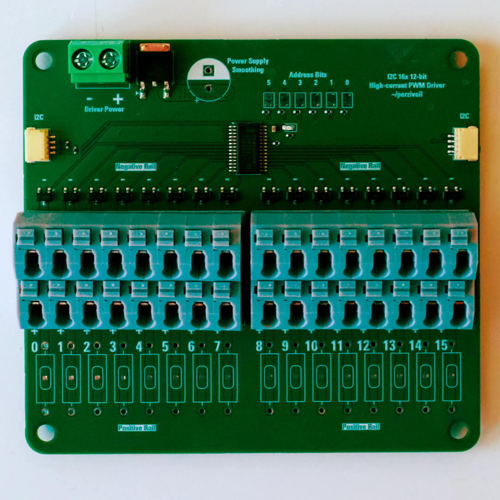

# I2C PWM MOSFET Driver

This PWM driver board uses a PCA9685 controlled over I2C to drive up to 16 high-current loads with PWM via N-channeo MOSFETs. Perfect for 12V or 24V LED strips.

- PCA9685 PWM controller with 12-bit PWM resolution
- 3.3V and 5V compliant VCC and I2C
- Terminal block for driver power, isolated from chip power (provided over I2C)
- 16 independently-controlled outputs with up to 30V 3A per channel, driven by AO3400A N-channel MOSFETs
- Supports up to 5A total across all channels
- Reverse polarity protection via HXY AOD413A P-channel MOSFET up to 8A at 10V
- Two STEMMA QT/QUIIC-compatible I2C headers for daisy chaining
- 6-bit address select broken out on solder pads
- Spring-loaded terminal blocks for driver output
- Pads on each channel for optional current limiting resistors (bypassed by default with a solder jumper)
- Pads for optional power supply smoothing capacitor
- Red power LED
- 10K Pull-ups to VCC on SDA and SCL
- Compatible with Adafruit's PCA9685 libraries for Arduino and CircuitPython

## Changes from Mk1 to Mk2

- Removed polarity protection P-channel MOSFET
- Increased trace widths on each channel
- Converted an entire internal layer to a +V_LED power path
